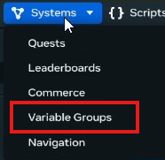
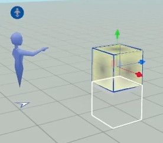
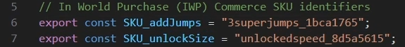
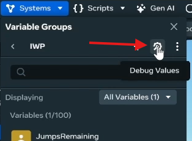
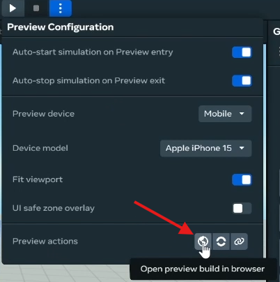
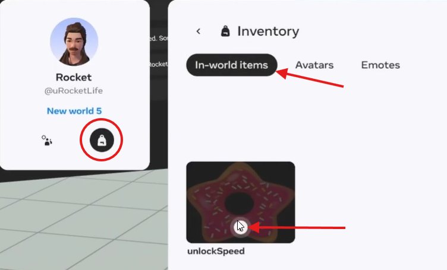
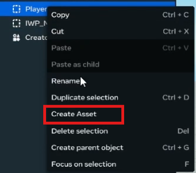
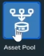

# In World Purchases (IWP) Start to Finish - by uRocketLife September 08, 2025

Keep your hands in the car at all times because you're in for a wild ride! This break down of consumable and durable purchases shows how easy it is to add In World Purchases (IWP) to your world. So buckle up and enjoy!

## Prerequisites
- This is for adventurous beginners and intermediate developers. 
- Basic familiarity with TypeScript in VS Code or similar IDE. 
- Basic knowledge of Player Persistant Variables (PPV)
- General Desktop Editor and Gizmo knowledge. 
- Mobile device with Horizon Worlds access to your account. 

## Introduction

In-world purchases (IWPs) in Meta Horizon Worlds allow creators to sell digital items and experiences to users using Meta Credits. Users purchase these digital items, which can be either consumable (one-time use, like a power-up) or durable (permanent, like access to a VIP area). Creators use the in-world commerce tools and shop gizmo to create and list items, set prices in Meta Credits, and manage their sales within their worlds. 

## What will our purchasables do?

Players who buy the consumable **3 Super Jumps** will have enhanced jump height for 3 jumps. After running out of jumps, they will revert back to a normal jump height.
Players who buy **UnlockedSpeed** will have a permanent speed boost.  


## What this tutorial covers

This tutorial is about 10 steps long.Though its focus is In World Purchases (IWP) it will cover a range of helpful areas to make general developing easier. FYI The paired video is about 20 minutes long which should give an idea about how long it will take to get through. 

Here's a breakdown of the steps with some 'gotchas' sprinkled in:

- 2 Commerce Variables
- 1 PPV
- **1st gotcha** – restart world to init variables
- 2 IWP Gizmos
- 1 IWP_Manager Script
- 1 PlayerSkills_Local Script
- 2 Tags
- **2nd gotcha** – testing purchases
- 1 mobile preview
- **3rd gotcha** – deleting purchases
- 1 desktop preview
- 1 asset creation
- 1 Asset Pool Gizmo

That's it! Are you ready? Let’s jump in!

## Youtube link

https://youtu.be/3boR7QOP9NA 

## Start of Tutorial

### Step 1 - Create World And In-World Items
In the Worlds Desktop Editor, created a new world. 

Go to Systems (dropdown) > Commerce


Create 2 in-world items: 
- 3SuperJumps | short description | 25 meta credits | Consumable | Auto use = Enabled


- unlockSpeed | short description | 25 meta credits | Durable


### Step 2 - Create PPV Variable
Got to Systems (dropdown) > Variable Groups



Create "+" a variable group called **IWP** 


Create "+" a PPV called **JumpsRemaining**


### 1st Gotcha - Restart World
Leave the world (shutdown server) and return. 
This ensures the variables are initiated into your world.


### Step 3 - IWP Gizmo
Go to Build (dropdown) > Gizmos and place **In-world Purchase** Gizmo. 


Add a platform shape for visual clarity of Gizmo location. 



Name Gizmo: "IWPSeller 3SuperJumps"

In the Gizmo Properties/Behavior: In-world Item = 3SuperJumps | UI Property = Icon


Duplicate Gizmo and rename: "IWPSeller UnlockSpeed"

Properties/Behavior: In-world Item = unlockSpeed

### Step 4 - Create Scripts and Objects

Create script: "PlayerSkills_Local"

Change Execution Mode: Local

Create script: "IWP_Manager"

Apply PlayerSkills_Local.ts to a new Empty Object renamed to: "PlayerSkills_Local"


Add a tag: "PlayerSkills"


Apply IWP_Manager.ts to a new Empty Object renamed to: "IWP_Manager"

Add a tag: "IWP_Manager"

### Step 5 - Update Scripts 

IWP_Manager
```typescript 
// Copyright (c) Dave Mills (RocketTrouble). Released under the MIT License.

import { CodeBlockEvents, Component, Entity, NetworkEvent, Player, WorldInventory } from "horizon/core";

// Persistent Player Variable (PPV) keys
export const PPV_RemainingJumps = "IWP:JumpsRemaining";
// In World Purchase (IWP) Commerce SKU identifiers
export const SKU_addJumps = "3superjumps_181deaf0";
export const SKU_unlockSize = "unlockspeed_05296351";
// Network events to communicate between IWP_Manager and PlayerSkills_Local
export const addJumpsEvent = new NetworkEvent<{ player: Player; jumps: number }>("addJumpsEvent");
export const saveRemainingJumps = new NetworkEvent<{ player: Player; jumpsRemaining: number }>("saveRemainingJumps");
export const unlockSpeedEvent = new NetworkEvent<{ player: Player }>("unlockSpeedEvent");

class IWP_Manager extends Component<typeof IWP_Manager> {
  static propsDefinition = {};

  //region preStart()
  preStart() {
    // Subscribe to item purchase events
    this.connectCodeBlockEvent(this.entity, CodeBlockEvents.OnItemPurchaseComplete, (player, item, success) => {
      if (success) {
        console.log(`Player ${player.name.get()} purchased item ${item}`);
        this.purchase(player, item);
      } else {
        console.log(`Player ${player.name.get()} failed to purchase item ${item}`);
      }
    });

    // Subscribe to item consume events
    this.connectCodeBlockEvent(this.entity, CodeBlockEvents.OnItemConsumeComplete, (player, item, success) => {
      if (success) {
        console.log(`Player ${player.name.get()} consumed item ${item}`);
        this.consume(player, item);
      } else {
        console.log(`Player ${player.name.get()} failed to consume item ${item}`);
      }
    });

    // Listen for players entering the world to load their PPVs and check durable purchases
    this.connectCodeBlockEvent(this.entity, CodeBlockEvents.OnPlayerEnterWorld, (player: Player) => {
      console.log("Player entered world:", player.name.get());
      
      //set a delay to avoid sending data before the PlayerSkills_Local component is ready
      const raceConditionDelay = 1500; // in milliseconds
      this.async.setTimeout(() => {
        //load player persistent variables
        this.loadPersistentPlayerVariables(player);
        this.checkDurablePurchase(player);
      }, raceConditionDelay);
      //check if they have durable purchases here
    });

    // Listen for jumpsRemaining updates to update persistent storage
    this.connectNetworkEvent(this.entity, saveRemainingJumps, (data) => {
      console.log("saveRemainingJumps received:", data.jumpsRemaining);
      this.world.persistentStorage.setPlayerVariable(data.player, PPV_RemainingJumps, data.jumpsRemaining);
    });
  }
  start() {}

  //region IWP Handlers
  //Check if player has durable purchase and send unlock event if they do
  async checkDurablePurchase(player: Player) {
    const hasDurable = await WorldInventory.doesPlayerHaveEntitlement(player, SKU_unlockSize);
    if (hasDurable) {
      console.log(`Player ${player.name.get()} has durable purchase: ${SKU_unlockSize}`);
      this.sendUnlockEventToPlayer(player);
    }
  }

  //Handle item purchases
  purchase(player: Player, item: string) {
    switch (item) {
      case SKU_addJumps:
        //Adding jumps is handled by consume event to ensure they are used
        break;
      case SKU_unlockSize:
        console.log(`Unlocking size for player ${player.name.get()}`);
        this.sendUnlockEventToPlayer(player);
        break;
      default:
        console.warn(`Unknown item purchased: ${item}`);
        break;
    }
  }

  //Handle item consumption
  consume(player: Player, item: string) {
    switch (item) {
      case SKU_addJumps:
        console.log(`Consumed item ${item} for player ${player.name.get()}`);
        this.sendJumpsToPlayer(player, 3);
        break;
        
      default:
        console.warn(`Unknown item consumed: ${item}`);
        break;
    }
  }
  //endregion IWP Handlers

  //region Network Events
  //Send unlock speed event to player
  sendUnlockEventToPlayer(player: Player) {
    const playerSkillsEntity = this.findPlayerSkillsOwnedByPlayer(player);
    if (playerSkillsEntity) {
      console.log(`Sending unlock event to player ${player.name.get()}`);
      this.sendNetworkEvent(playerSkillsEntity, unlockSpeedEvent, { player: player });
    } else {
      console.warn(`No PlayerSkills entity found for player ${player.name.get()}`);
    }
  }

  //Send jumps to player
  sendJumpsToPlayer(player: Player, jumps: number) {
    const playerSkillsEntity = this.findPlayerSkillsOwnedByPlayer(player);
    if (playerSkillsEntity) {
      console.log(`Sending ${jumps} jumps to player ${player.name.get()}`);
      this.sendNetworkEvent(playerSkillsEntity, addJumpsEvent, { player: player, jumps: jumps });
    } else {
      console.warn(`No PlayerSkills entity found for player ${player.name.get()}`);
    }
  }
  //endregion Network Events

  //region Persistent Player Variables
  //Load persistent player variables
  loadPersistentPlayerVariables(player: Player) {
    // Load player persistent variables here
    const remainingJumps = this.world.persistentStorage.getPlayerVariable<number>(player, PPV_RemainingJumps) || 0;
    console.log(`Loaded persistent jumps for ${player.name.get()}: ${remainingJumps}`);
    //Send the result to the PlayerSkills component
    if (remainingJumps > 0) {
      this.sendJumpsToPlayer(player, remainingJumps);
    }
  }
  //endregion Persistent Player Variables

  //region Helper Func
  //Find the PlayerSkills entity owned by the given player
  findPlayerSkillsOwnedByPlayer(player: Player): Entity | undefined {
    const playerSkills = this.world.getEntitiesWithTags(["PlayerSkills"]);
    for (const entity of playerSkills) {
      const owner = entity.owner.get();
      if (owner && owner.index === player.index) {
        return entity;
      }
    }
  }
  //endregion Helper Func
}
Component.register(IWP_Manager);
```

PlayerSkills_Local 
```typescript 
// Copyright (c) Dave Mills (RocketTrouble). Released under the MIT License.

import {
  ButtonIcon,
  CodeBlockEvents,
  Component,
  Entity,
  Player,
  PlayerControls,
  PlayerInputAction,
  PropTypes,
} from "horizon/core";
import { addJumpsEvent, saveRemainingJumps, unlockSpeedEvent } from "IWP_Manager";

class PlayerSkills_Local extends Component<typeof PlayerSkills_Local> {
  static propsDefinition = {
    // Enable or disable automatic assignment of the component to the world owner
    autoAssignOwner: { type: PropTypes.Boolean, default: false }, // Automatically assign to the world owner
  };

  localOwner!: Player;

  jumpsRemaining: number = 0;
  speedUnlocked: boolean = false;

  iwp_Manager!: Entity;

  preStart() {
     //Auto-assign player entering world as 'Local owner' while developing
    if (this.props.autoAssignOwner) {
      this.connectCodeBlockEvent(this.entity, CodeBlockEvents.OnPlayerEnterWorld, (player) => {
        console.log("Auto-assigning PlayerSkills_Local component to world owner:", player.name.get());
        this.entity.owner.set(player);
      });
    }

    //prevent further action if the server is the local owner
    if (this.entity.owner.get() === this.world.getServerPlayer()) {
      return;
    }

    //receive events from IWP_Manager
    this.connectNetworkEvent(this.entity, addJumpsEvent, (data) => {
      console.log("addJumpsEvent received:", data.jumps);
      if (this.entity.owner.get().index === data.player.index) {
        this.jumpsRemaining += data.jumps;

        //set jump speed to boosted value
        this.localOwner.jumpSpeed.set(10);
      }
    });

    //receive events from IWP_Manager
    this.connectNetworkEvent(this.entity, unlockSpeedEvent, (data) => {
      if(this.entity.owner.get().index === data.player.index) {
        this.speedUnlocked = true;
        const curSpeed = this.localOwner.locomotionSpeed.get();
        this.localOwner.locomotionSpeed.set(curSpeed * 3);
        console.log("Speed unlocked for player:", data.player.name.get());
      }
    });
  }

  start() {
    //prevent further action if the server is the local owner
    if (this.entity.owner.get() === this.world.getServerPlayer()) {
      return;
    }

    this.iwp_Manager = this.world.getEntitiesWithTags(["IWP_Manager"])[0];
    if (!this.iwp_Manager) {
      console.error("IWP_Manager entity not found in the world.");
      return;
    }

    //Assign local owner
    this.localOwner = this.entity.owner.get();
    console.log("PlayerSkills_Local assigned to player:", this.localOwner.name.get());
    //Make sure player has normal jump speed at start
    this.localOwner.jumpSpeed.set(4.5);

    //Subscribe to jump input
    const input = PlayerInputAction.Jump;
    //connect the input to the jump action
    const jumpButton = PlayerControls.connectLocalInput(input, ButtonIcon.Jump, this);
    //Register a callback for when the jump button is pressed
    jumpButton.registerCallback((action, pressed) => {
      if (pressed && this.jumpsRemaining > 0) {
        //reduce jumps remaining
        this.jumpsRemaining--;
        //reset jump speed to normal if no jumps remain
        if (this.jumpsRemaining === 0) {
          console.log(`Player ${this.localOwner.name.get()} jumped. No jumps remaining.`);
          this.localOwner.jumpSpeed.set(4.5);
        } else {
          console.log(`Player ${this.localOwner.name.get()} jumped. Jumps remaining: ${this.jumpsRemaining}`);
          //Local scripts can set PPV so send to IWP_Manager to update persistent storage
        }
      }
      //send initial jumps remaining to IWP_Manager to sync persistent storage
      this.sendNetworkEvent(this.iwp_Manager!, saveRemainingJumps, { player: this.localOwner, jumpsRemaining: this.jumpsRemaining });
    });
  }
}
Component.register(PlayerSkills_Local);
```

### Step 6 - Customize the IWP_Manager Script

**ATTENTION!** : We need to replace some values to work!

At the top of the script we define exported constants.

Notice our PPV_RemainingJumps is the "Group Variable Name":"PPV name"; 

That's important when 'getting' and 'setting' PPV values. 

Next, we need to get the **SKU** values for our In-world Items. 



Navigate to the Systems (dropdown) > Commerce

Find the **Copy SKU** button for **3SuperJumps**


Paste the value into (ln 6) **SKU_addJumps** = "paste here"

Repeat the steps for **SKU_unlockSize**

### Step 7 - Important Events in IWP_Manager Script 

On (ln 19) we see an event for **OnItemPurchaseComplete**. This is how we can determine if a purchase was successful or not

On (ln 29) we see an event for **OnItemConsumeComplete**. Auto-consumed items will trigger Purchase and Consume Events automatically in that order. 


Take a look at the video and the code comments for a better understanding of the scripts.

### Step 8 - Enable AutoAssignOwner on PlayerSkills_Local

On the PlayerSkills_Local Object > Properties/Script PropsDefinition: AutoAssignOwner = **Enable** . 


AutoAssignOwner is a developer hack to easily assign Local ownership to the player during development. Local ownership of the PlayerSkills_Local Entity allows the script to access and edit player jump power and player speed. This is, however, not a final solution. We will turn this feature off when we create an asset from the PlayerSkills_Local object to use with the Asset Pool Gizmo. 


### Step 9 - Quick Jump Test

We want to test the player's jumps. 

Go to Systems (dropdown) > Variable Groups > IWP > Debug Values (wrench/gear icon) and **change value to 3**



Open the **Console** tab, **Press Play**, and **Jump 4 times**. 

See the jumps run out and the player jump go back to normal. 

### Step 10 - Practice Purchase & Debug Gizmo

Notice, if you try to purchase in editor, it will fail. 

We'll be using a **Mobile Preview** to test our purchase. 

First, we'll want to see logs. However, we have no way of seeing logs on our mobile device. 

Dun duh duh dah! **Debug Gizmo!** Go to Build (dropdown) > Gizmos and Find, Place, and Resize the Debug Gizmo. 


In the **Properties/ Behavior** change Visibility = In Published World


Next, go to the **three vertical dot** button next to the Play button > Preview Actions and select the middle: Send Preview build link to the Meta Horizon mobile app. 


Open Horizon World app on your phone and test the Jump and Speed purchase!


### Step 11 - Deleting purchases

To delete the **Durable** purchase we need to go to the Desktop App. 

Go to the **three vertical dot** button next to the Play button > Preview Actions and select the first: Open preview build in browser. 



Press Tab to open the menu, find the **backpack icon** on the left window, select the **In-world Items** tab, select the **info** button, and finally use the **trash can** to delete the purchase. 



## Step 12 - Create Asset and Asset Pool Gizmo

We're going to turn the **PlayerSkills_Local** object into an asset. 

**First! Disable the AutoAssignOwner toggle!**


Then *right-click* > Create Asset. Keep the name. Remember where you save it. Then *delete* the object from the Heirarchy. 



Next, go to Build > Gizmos > Asset Pool and place one. 



Rename to PlayerSkills Asset Pool and then move your attention to the Properties Panel/ Behavior/ Asset Reference. 

Assign the 'PlayerSkills asset' in your Asset Library to the "Asset Reference"

Open the Asset Pool and see how it's been autopopulated to match the max amount of players your world is set up to support? 

You now have multiplayer support! 


## Conclusion 

OK, so it was a liiitle more than 10 steps but it was pretty close! And don't you feel **POWERFUL**? It feels good right!?

**I knew you could do it!**

I had a lot of fun making this tutorial and I'm glad you made it the whole way!

Hope it was helpful and I'll check you later! 


-uRocketLife
